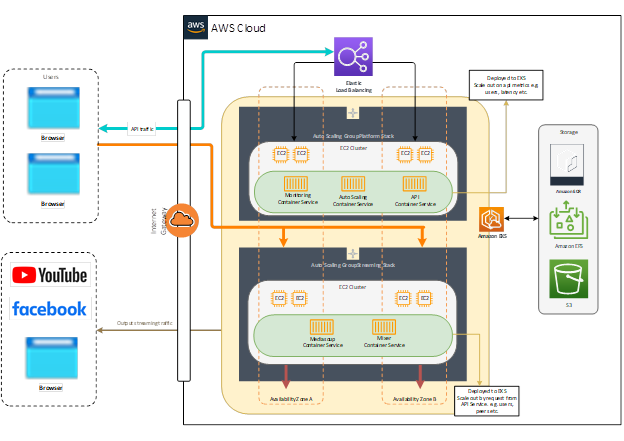

# Infrastructure

## VPC

| Name | Count |
|------|--------|
| Public Subnets | 3 |
| Private Subnets | 3 |
| Nat gateway| 1|

Provide network for k8s cluster and aws services

## EKS

The cluster have 4 node groups which targets to dedicated feature.

| Node group | Desc |
|------|--------|
| App node group | use for commom applications (react-app, mixer-nginx, server-api) |
| Media node group | use for mediasoup servers |
| Mixer node group  | use for mixer workers |
| Addon node group | use for k8s addons | 

## EFS

Using to storage recorded videos

## EBS

Storate sqlite database for server-api

## NLB
Network loadbalancer as external ingress for k8s. It is controled by nginx-ingress controller

## Cloudflare

Manage domain and SSl

# App flow

