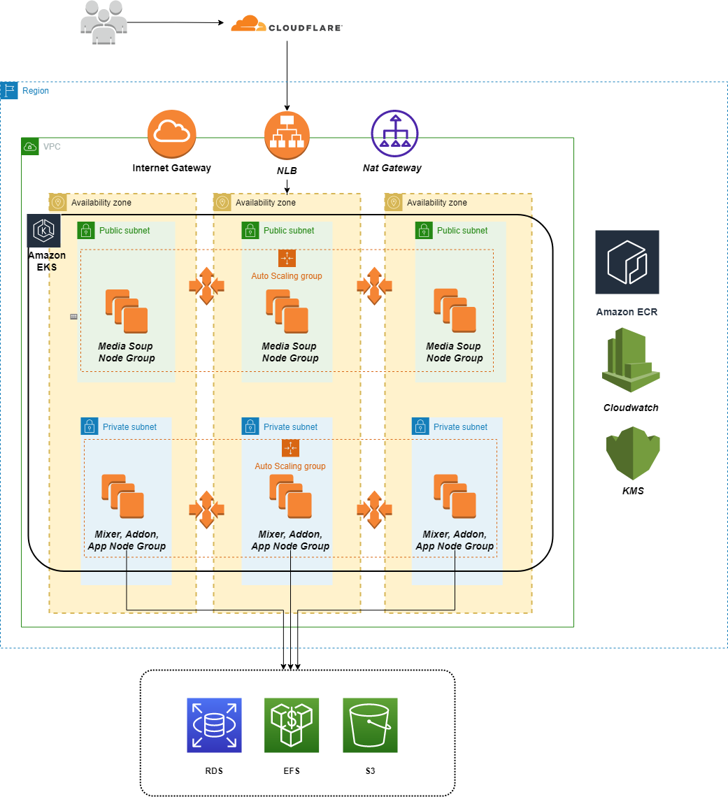
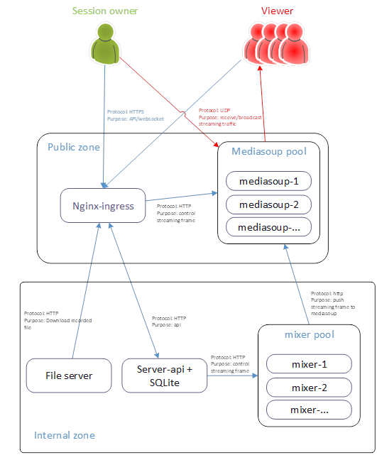

# Infrastructure

## VPC

| Name | Count |
|------|--------|
| Public Subnets | 3 |
| Private Subnets | 3 |
| Nat gateway| 1|

Provide network for k8s cluster and aws services

## EKS

The cluster have 4 node groups which targets to dedicated feature.

| Node group | Desc |
|------|--------|
| App node group | use for commom applications (react-app, mixer-nginx, server-api) |
| Media node group | use for mediasoup servers |
| Mixer node group  | use for mixer workers |
| Addon node group | use for k8s addons | 

## EFS

Using to storage recorded videos

## EBS

Storate sqlite database for server-api

## NLB
Network loadbalancer as external ingress for k8s. It is controled by nginx-ingress controller

## Cloudflare

Manage domain and SSl

# App flow

# FAQ

1. How are your using namespaces?
We are using `namespace` to isolate the application enviroment or dedicated group of pods (monitoring,argocd...)

2. How are you securing your pods (IRSA)?

We follow the least privilege principle and set IAM for service account and use it at pod level to retrict access to resources.

3. How are you scaling workloads using custom metrics (from Mediasoup, API layer etc)?

Currently the api server will manage workload and sessions at application level. Then using k8s apis to provision new pods on cluster. In EKS side, we are using `cluster-autoscaler` to scale in or out the requests from api server.

4. How are you controlling the placement of critical workloads in the cluster?

We use Prometheus to monitor the cluster and HPA to control the workload

5. How are you managing data (storage classes)?

We using `ebs` and `efs` to manage temporary and shared storage

6. How do we upgrade a cluster without impacting service?

https://docs.aws.amazon.com/eks/latest/userguide/update-cluster.html

